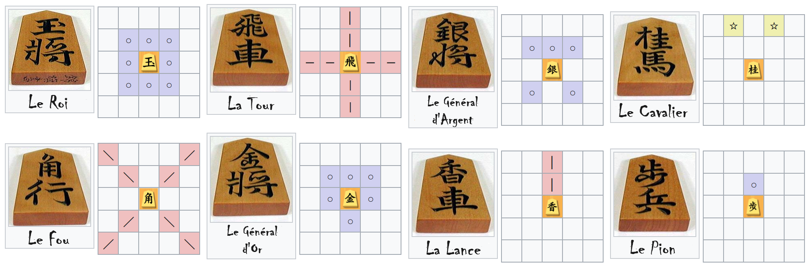
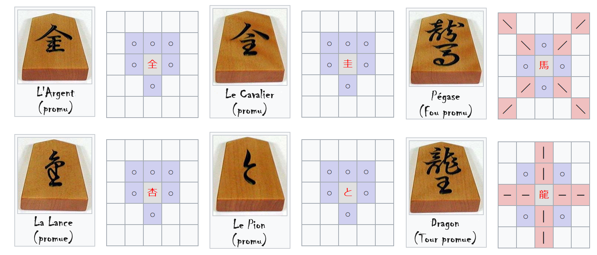
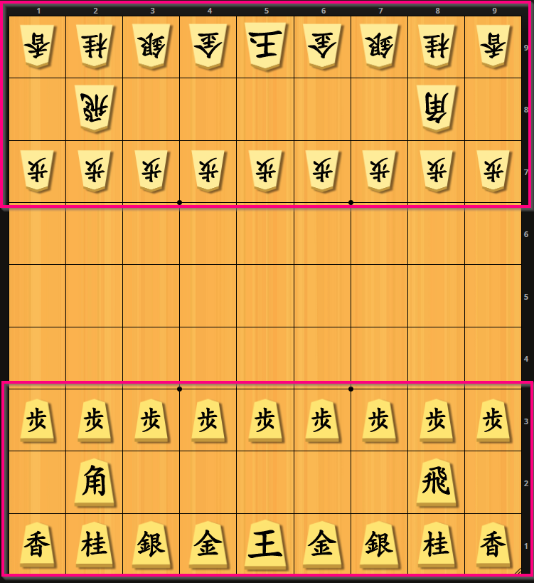
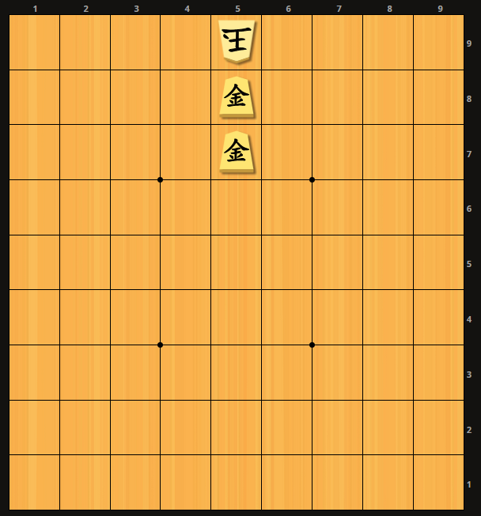

```{r setup, include=FALSE}
knitr::opts_chunk$set(echo = FALSE)
```

## Les échecs japonais


<aside class="notes" data-markdown>

https://lishogi.org/editor

- M pour ouvrir le menu
- C pour écrire sur les slides
- B pour ouvrir un tableau blanc 
- S pour afficher le mode présentation
- F pour le mode plein écran
- O pour le mode survol
- ? pour les raccourcis clavier
</aside>


## Déplacements

{width=200%}

<aside class="notes" data-markdown>
- Déplacements du roi, de la tour et du fou : comme aux échecs ; ce sont les pièces les plus importantes (leur taille est aussi un peu plus élevée)
- Déplacement des généraux (or : frontal et "plus", argent : frontal et "fois") ; utiles en défense comme en attaque, souvent 2 or et un argent restent près du roi pour bloquer l'attaque, et un argent se faufile entre les pions pour appuyer l'attaque de la tour
- Déplacement des pions : tout droit, tout simple ("je me déplace et je prends là où j'arrive") ; un seul pion par colonne quoi qu'il arrive
- Déplacement de la lance : tour qui ne recule pas et qui ne tourne pas (elle est "lancée", ahah) ; utile surtout en défense, et dans certains scénarios spécifiques, mais passe souvent toute la partie immobile
Déplacement du cavalier : comme aux échecs ("saute" en L), mais seulement vers l'avant ; utile pour les fourchettes lors d'un parachutage, ou pour fixer le point focal d'une attaque ou d'une défense (Shikamaru dans Naruto)
</aside>


## Promotion (1/3)

{width=200%}


## Promotion (2/3)

{width=60%}


## Promotion (3/3)


## Parachutage

<aside class="notes" data-markdown>
Montrer atamakin
</aside>

## Fin de partie



## Démonstration - Défense et contre-attaque

<iframe width="470" height="650" src="https://www.youtube.com/embed/DItsHNmIMus" title="【気をつけて】初心者がやりがちな悪手。将棋ウォーズ3分切れ負け" frameborder="0" allow="accelerometer; autoplay; clipboard-write; encrypted-media; gyroscope; picture-in-picture; web-share" allowfullscreen></iframe>


## Démonstration - Échange de fous

<iframe width="470" height="650" src="https://www.youtube.com/embed/P0glpYNj-xU" title="１分でわかる角交換四間飛車の攻め方‼️中盤の攻めの手筋の紹介です。" frameborder="0" allow="accelerometer; autoplay; clipboard-write; encrypted-media; gyroscope; picture-in-picture; web-share" allowfullscreen></iframe>

## À vous de jouer !

<iframe width="470" height="650" src="https://www.youtube.com/embed/ti5B9K2vMPA" title="【将棋】女流棋士・香川愛生 #Shorts" frameborder="0" allow="accelerometer; autoplay; clipboard-write; encrypted-media; gyroscope; picture-in-picture; web-share" allowfullscreen></iframe>

## Pour aller plus loin

* [Accéder au site de la Fédération Française de Shôgi](https://shogi.fr/)
* [Jouer en ligne](https://lishogi.org/)
* [Analyser des parties officielles](https://shogidb2.com)

<!-- pour moi :
- https://github.com/rstudio/revealjs
- https://revealjs.com/themes/
- https://lishogi.org/editor/
- https://shogifrance.1fr1.net/
- http://ffshogi.e-monsite.com/medias/files/shogi-papier.pdf
- http://ffshogi.e-monsite.com/medias/files/regles-shogi-4.01.pdf
- https://www.zmo.ai/anime-character-creator/
- https://en.wikipedia.org/wiki/Shogi
- http://fesashogi.eu/index.php?mid=5&player=Jocelyn+B%E9ziau
-->
